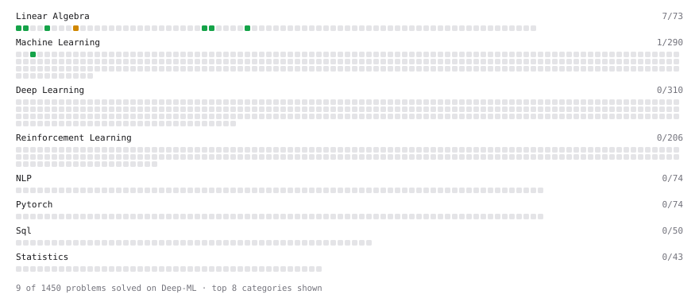

# Deep-ML

My machine learning practice from [Deep-ML](https://www.deep-ml.com). Every solution here was written by hand.

**13** solved · 12 problems · 0 labs · 1 math

[**Browse the interactive portfolio**](https://Udhayaudhay.github.io/deep-ml/) to replay this filling in over time.

## Problems

| | Difficulty | Solved | |
| --- | --- | --- | --- |
| [Calculate Cosine Similarity Between Vectors](https://www.deep-ml.com/problems/76) | easy | 2026-09-17 | [solution](problems/0076-calculate-cosine-similarity-between-vectors) |
| [Derivative of a Polynomial](https://www.deep-ml.com/problems/116) | easy | 2026-09-18 | [solution](problems/0116-derivative-of-a-polynomial) |
| [Dot Product Calculator](https://www.deep-ml.com/problems/83) | easy | 2026-09-17 | [solution](problems/0083-dot-product-calculator) |
| [Feature Scaling Implementation](https://www.deep-ml.com/problems/16) | easy | 2026-04-04 | [solution](problems/0016-feature-scaling-implementation) |
| [Linear Regression Using Gradient Descent](https://www.deep-ml.com/problems/15) | easy | 2026-07-02 | [solution](problems/0015-linear-regression-using-gradient-descent) |
| [Linear Regression Using Normal Equation](https://www.deep-ml.com/problems/14) | easy | 2026-07-18 | [solution](problems/0014-linear-regression-using-normal-equation) |
| [Matrix-Vector Dot Product](https://www.deep-ml.com/problems/1) | easy | 2026-09-18 | [solution](problems/0001-matrix-vector-dot-product) |
| [Random Shuffle of Dataset](https://www.deep-ml.com/problems/29) | easy | 2026-04-09 | [solution](problems/0029-random-shuffle-of-dataset) |
| [Scalar Multiplication of a Matrix](https://www.deep-ml.com/problems/5) | easy | 2026-09-18 | [solution](problems/0005-scalar-multiplication-of-a-matrix) |
| [Transpose of a Matrix](https://www.deep-ml.com/problems/2) | easy | 2026-09-18 | [solution](problems/0002-transpose-of-a-matrix) |
| [Vector Element-wise Sum](https://www.deep-ml.com/problems/121) | easy | 2026-09-17 | [solution](problems/0121-vector-element-wise-sum) |
| [Matrix times Matrix ](https://www.deep-ml.com/problems/9) | medium | 2026-09-18 | [solution](problems/0009-matrix-times-matrix) |

## Math

| | Difficulty | Solved | |
| --- | --- | --- | --- |
| [Gradient Descent Updates](https://www.deep-ml.com/math-problems/5) | easy | 2026-09-18 | [solution](math/0005-gradient-descent-updates) |

---

_This file is regenerated by Deep-ML on every push._
